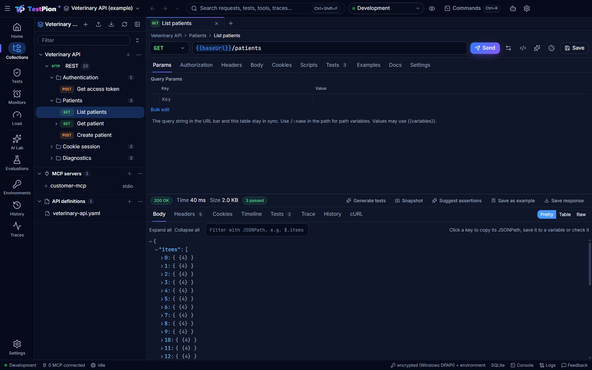

<p align="center"></p>

# FluxPion

**A local-first desktop app and CLI for testing, debugging and evaluating REST, GraphQL and WebSocket APIs, MCP servers, LLM APIs, RAG pipelines and AI agents.**

FluxPion brings together an API client, a GraphQL playground, an MCP inspector, an LLM playground and evaluation lab, a scalable test runner and a trace viewer. All of them run on one execution engine, which the `fluxpion` CLI also uses in CI.

**Website and docs:** https://nasimuddin-dev.github.io/fluxpion/ · **Download:** [Windows, macOS, Linux](https://nasimuddin-dev.github.io/fluxpion/download)



## Features

- **REST / HTTP.** Any method; JSON, XML, text, HTML, form, multipart and binary bodies; a per-workspace cookie jar with a Cookies manager (encrypted, never in workspace files); API key, Basic, Bearer, JWT, OAuth 2.0 (client credentials, password, auth code with PKCE) and mTLS. Large responses stream to disk while a virtualised viewer shows the preview. Responses include a timeline, sandboxed pre-request and test scripts, and SSE streaming.
- **GraphQL.** Introspection, a schema explorer, and a Monaco editor with schema-aware autocomplete, validation and formatting. GraphQL-specific assertions.
- **MCP.** stdio, Streamable HTTP and SSE transports. Discovery of tools, resources, templates and prompts. Forms generated from each tool's JSON Schema, save-as-test, and a full JSON-RPC protocol trace with latency.
- **WebSocket.** Connect, send and inspect messages.
- **AI / LLM.** OpenAI-compatible, Azure OpenAI, Anthropic, Gemini, Ollama and an offline mock provider. Prompt templates, structured-output validation, streaming with time-to-first-token, token and cost tracking (prices are configurable and versioned), side-by-side model comparison, and rate limits with backoff.
- **AI help.** Describe a request in plain words, generate `pm.test` checks for a response, and explain failed responses (always labelled, never run automatically).
- **For AI agents.** `fluxpion mcp-server` lets Claude and other agents browse your collections, send requests and run collections over MCP, with secrets redacted and production environments protected. The docs site publishes `llms.txt`.
- **Evaluation.** Deterministic, heuristic, embedding and LLM-as-judge evaluators, with AI-judge results always labelled. RAG metrics, agent tool-use checks and safety checks (prompt injection, data leakage, tool misuse). Streamed datasets (JSONL, CSV, JSON, Markdown, URL) and regression baselines.
- **Test runner.** YAML suites with parallel workers, backpressure, retries, timeouts, dependencies, setup/teardown, cancellation and resumable runs. JUnit, JSON, HTML and Markdown reports.
- **Load testing.** Virtual users, ramp-up/down and RPS caps, reporting p50–p99, error rate and status distribution, plus AI metrics (tokens/s, TTFT, cost). Safeguards block production and remote hosts by default.
- **Observability.** An OpenTelemetry-shaped trace for every execution, with a waterfall viewer, and a Postman-style console (Ctrl+Alt+C) with every request and its script output, redacted.
- **Workspace.** Collections with inherited auth, Postman-compatible `pm.*` scripts and saved response examples, local mock servers that serve those examples, Markdown documentation for requests and collections (with export), a Collection Runner (iterations, CSV/JSON data files, delay, `setNextRequest`), environments with precedence (Global → Workspace → Environment → Collection → Request → Runtime) and a quick look, a Home view, history grouped by day, global search and a command palette (Ctrl/Cmd+K). Import from OpenAPI, Postman or HAR, or paste a request copied from browser devtools (cURL, fetch or PowerShell); export collections and environments to Postman v2.1.
- **Security and privacy.** Secrets are stored in the OS credential store (DPAPI, Keychain or Secret Service) and never in workspace files. Redaction covers logs, traces, reports and exports. Scripts run in a QuickJS/WASM sandbox. Telemetry is not implemented.

## Installation

Download the installer for your system from the [download page](https://nasimuddin-dev.github.io/fluxpion/download) or the [latest GitHub release](https://github.com/nasimuddin-dev/fluxpion/releases/latest):

| System | Files |
| --- | --- |
| Windows 10/11 x64 | `FluxPion-<version>-windows-x64-setup.exe` (installer) or `-portable.exe` |
| macOS 12+ | `FluxPion-<version>-macos-arm64.dmg` (Apple Silicon) or `-macos-x64.dmg` (Intel) |
| Linux x86_64 | `.AppImage`, `.deb` or `.rpm` |

The installers aren't code-signed yet; the [installation guides](https://nasimuddin-dev.github.io/fluxpion/installation/windows) explain the first-launch prompts.

### From source

```bash
git clone https://github.com/nasimuddin-dev/fluxpion.git
cd fluxpion
npm install
npm run build
npm run dev                      # desktop app (Electron)
npm run package -w @fluxpion/desktop  # installers for your OS in apps/desktop/release/
npm link -w @fluxpion/cli             # `fluxpion` CLI
```

Requires Node.js 22.13+ (Node 24+ recommended) to build.

## Quick start

```bash
node examples/servers/demo-servers.mjs           # local REST, GraphQL, mock LLM and WebSocket servers
fluxpion run -w examples/veterinary-workspace --suite regression
```

This runs 22 tests covering REST, GraphQL, MCP, LLM, RAG, agent and safety checks, and writes reports to `examples/veterinary-workspace/runs/<runId>/`.

### REST example

```yaml
name: List patients
type: http
method: GET
url: "{{baseUrl}}/patients"
auth: { type: bearer, token: "{{accessToken}}" }
assertions:
  - { type: status, expected: 200 }
  - { type: exists, path: $.items[0].id }
  - { type: latency, max: 500 }
```

### GraphQL example

```yaml
name: Get Patient
type: graphql
endpoint: "{{graphqlEndpoint}}"
query: |
  query GetPatient($id: ID!) { patient(id: $id) { id name species } }
variables: { id: "123" }
assertions:
  - { type: graphql-no-errors }
  - { type: exists, path: $.data.patient.id }
```

### MCP example

```yaml
name: Search Customer MCP Tool
type: mcp
server: customer-mcp
tool: search_customer
arguments: { customer_id: "123" }
assertions:
  - { type: status, expected: success }
  - { type: equals, path: $.customer.id, expected: "123" }
```

### AI evaluation example

```yaml
name: Intent dataset
type: llm
model: { provider: openai, name: my-model, temperature: 0 }
prompt: 'Classify as JSON {"intent": "..."}: {{message}}'
responseFormat: { type: json }
dataset: { path: ../../datasets/intents.jsonl }
evaluators:
  - { type: exact-match, path: $.intent, expected: "{{expected}}" }
  - { type: llm-judge, judge: { provider: openai, name: judge-model }, criteria: "The intent is correct", threshold: 0.7 }
```

### CI

```bash
fluxpion test ./tests -e Staging -r console junit html -o results
# run a collection like Newman, including Postman collection/environment files and CSV data
fluxpion run-collection api.postman_collection.json -e staging.postman_environment.json -d data.csv
# keep cookies between runs (a Newman cookie jar file works too)
fluxpion run-collection api.postman_collection.json --cookie-jar cookies.json --export-cookie-jar cookies.json
# exit codes: 0 success · 1 test failure · 2 configuration error · 3 execution error
```

## Architecture

```text
apps/desktop   Electron + React + Monaco (sandboxed renderer, IPC RPC bridge)
packages/cli   fluxpion CLI
packages/core  the single execution engine: protocol adapters, AI providers, agent loop,
               variables, sandboxed scripts, checks/evaluators, tracer, streaming runner,
               reports, load testing, storage (files + SQLite + secret stores), importers
docs/          Markdown documentation (VitePress → GitHub Pages)
examples/      demo servers and an example workspace
tests/         unit, integration and end-to-end tests
scripts/       benchmark
```

See [docs/architecture/overview.md](docs/architecture/overview.md).

## Documentation

Read it at **https://nasimuddin-dev.github.io/fluxpion/**. The Markdown sources live in [`docs/`](docs/index.md); build the site with `npm run docs:build`. `.github/workflows/docs.yml` publishes it to GitHub Pages.

## Releasing

Bump `version` in `package.json` and `apps/desktop/package.json`, add a `CHANGELOG.md` section, then push a matching tag (for example `v0.1.1`). `.github/workflows/release.yml` builds the Windows, macOS and Linux installers and publishes them to a GitHub Release with `SHA256SUMS.txt`. Regenerate the website screenshots with `npm run screenshots -w @fluxpion/desktop`.

## Roadmap

- gRPC, MQTT and Kafka adapters; GraphQL subscriptions over graphql-ws
- Mock HTTP, GraphQL and MCP servers in the app (a mock LLM provider already exists)
- A native AWS Bedrock provider (SigV4)
- Database-query datasets
- Optional cloud execution, team workspaces and scheduling (SRS Phase 9)

## Contributing

See [CONTRIBUTING.md](CONTRIBUTING.md). To report a security issue, see [SECURITY.md](SECURITY.md).

## License

[MIT](LICENSE)
